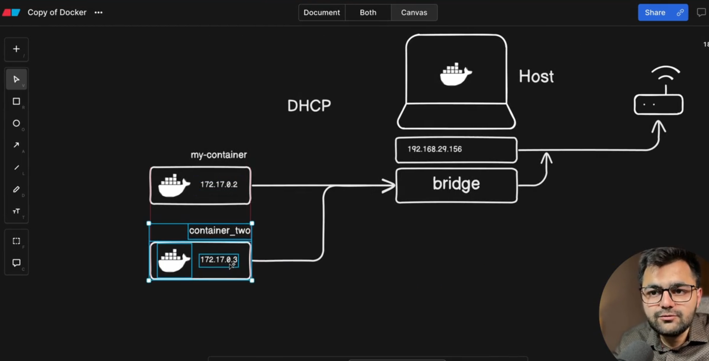
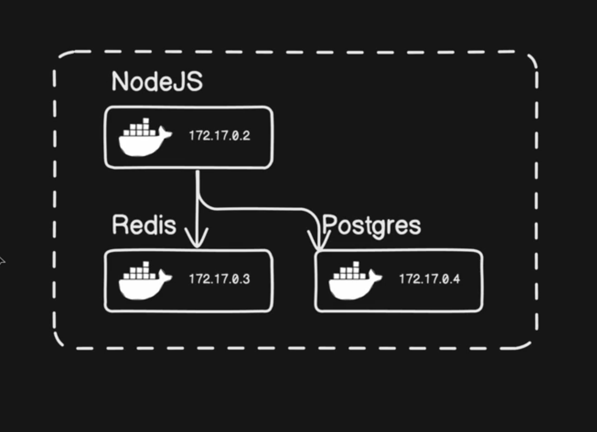
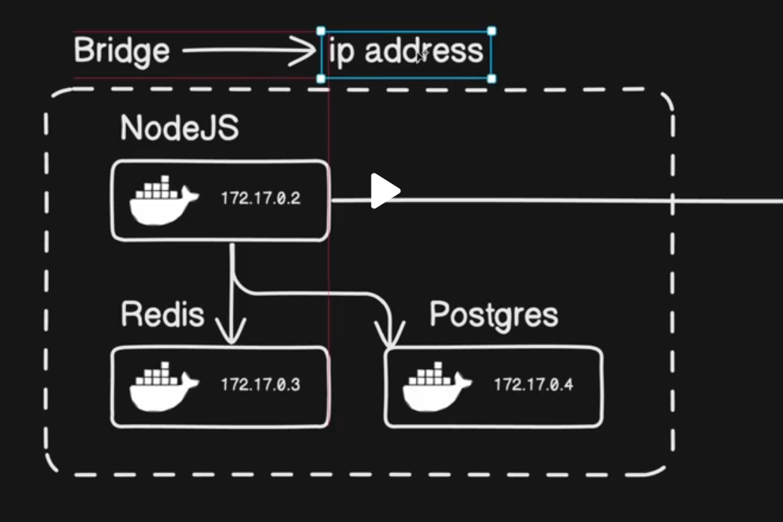

#Networking

Container networking referes to the ability for containers to connect to and communicate with each , or to non-Docker workloads


```
Conatiners have networking enabled by default. they can make outgoing connections

container has no info about what kind of network its attached to or dont know about there peers too.

Container Sees a network interface with an
  -- Ip address
  -- a gateway
  -- a routing table
  -- DNS services
```


Docker network
```
docker networks

docker network ls
NETWORK ID     NAME      DRIVER    SCOPE
f5cc9dc5dd9f   bridge    bridge    local
ad5695745bd4   host      host      local
5420f7523932   none      null      local

```




Here all 3 are in same network.

Communicate


```

Bridge networks are commonly used when your application runs in a container that needs to
communicate with other containers on the same host(see figure 2 nodejs IP address)

``
How to ping another container while being inside another container?
```
#Get the ip of the the container you want to ping
 --- docker network inspect bridge 
 copy the ipaddress - remember to remove /number in the Ip address that is CIDR notation(network mask)

 Now run -> docker exec <container-name> ping <IP Address of container you want to ping>
```


#Types of bridges
1: Default 
2: User - Automatic DNS hota hai, name se IP nikal jayega with that network of container