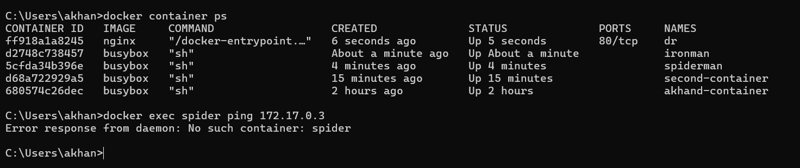

#Create your own bridge network
```
#docker network 

``
nhi hoga


How can they talk to each then
```
docker network connect <from> <to> (name of the network)
e.g docker network connect milkyway second-container
e.g docker network inspect milkyway (isme dekhna ab add hogya hoga)
e.g docker exec spiderman second-container (ab ping ho rha hai spiderman ke andar se)
```

#disconnect-> just do - docker network disconnect <NetworkName>